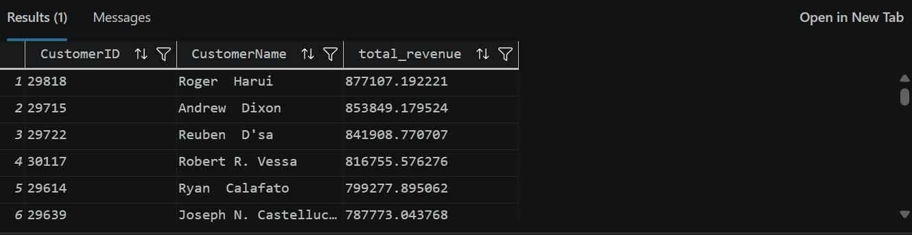

## Case Study 1 – Customer Purchase Value

### Business Question

Which individual customers generated the highest total sales revenue?

### Business Assumption

The analysis includes individual customers who can be linked to a person record in AdventureWorks. Total sales revenue is calculated from transactional sales data.

### Data Sources

- `Sales.Customer`
- `Sales.SalesOrderHeader`
- `Sales.SalesOrderDetail`
- `Person.Person`

### SQL Concepts

- SELECT
- JOIN
- CONCAT
- SUM
- GROUP BY
- ORDER BY

### Business Insight

The analysis identifies the individual customers generating the highest total sales revenue, helping the business understand which customers contribute the most to overall sales.

### Result

