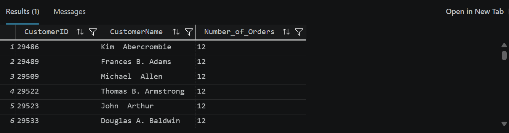
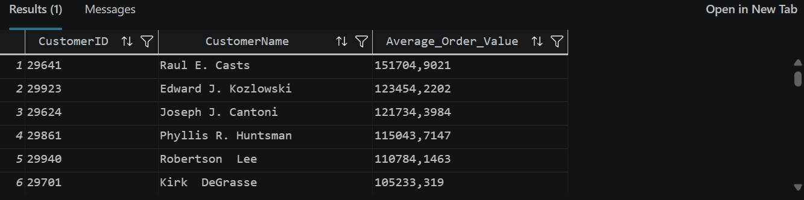

## Case Study 1 – Customer Purchase Value

### Business Question

Which individual customers generated the highest total sales revenue?

### Business Assumption

The analysis includes individual customers who can be linked to a person record in AdventureWorks. Total sales revenue is calculated from transactional sales data.

### Data Sources

- `Sales.Customer`
- `Sales.SalesOrderHeader`
- `Sales.SalesOrderDetail`
- `Person.Person`

### SQL Concepts

- SELECT
- JOIN
- CONCAT
- SUM
- GROUP BY
- ORDER BY

### Business Insight

The analysis identifies the individual customers generating the highest total sales revenue, helping the business understand which customers contribute the most to overall sales.

### Result

## Case Study 2 – Customer Order Frequency

### Business Question

Which individual customers placed the highest number of sales orders?

### Business Assumption

The analysis includes individual customers only. Each sales order is counted once and assigned to the corresponding customer.

### Data Sources

- `Sales.Customer`
- `Sales.SalesOrderHeader`
- `Person.Person`

### SQL Concepts

- SELECT
- JOIN
- CONCAT
- COUNT
- GROUP BY
- ORDER BY

### Business Insight

The analysis identifies the most active customers based on the number of sales orders placed, helping the business recognize loyal customers and support customer retention initiatives.

### Result

## Case Study 3 – Average Order Value by Customer

### Business Question

Which individual customers have the highest average sales order value?

### Business Assumption

The analysis includes individual customers only. The average order value is calculated using the total value of each sales order.

### Data Sources

- `Sales.Customer`
- `Sales.SalesOrderHeader`
- `Person.Person`

### SQL Concepts

- SELECT
- JOIN
- AVG
- GROUP BY
- ORDER BY

### Business Insight

The analysis identifies customers with the highest average sales order value, helping the business distinguish high-value customers from those who place frequent but smaller orders.

### Result

